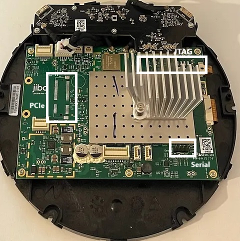
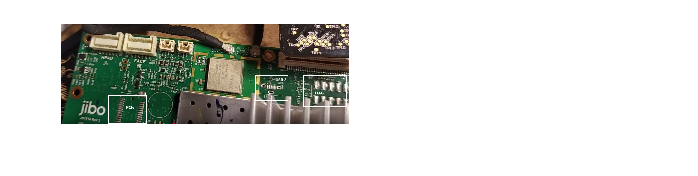

# HW_Notes
Jibo mainboard was based upon hardware designed by Avionic's Design

    from Uboot log
    Model: Avionic Design Kein Baseboard
    Board: Avionic-Design Kein Baseboard, ID: -2

    [    0.000000] Machine: Avionic Design Meerkat (Device Tree), model: Avionic Design Tobor All In One, serial: 0
    
Details on that board and its related carrier board are described here [Tegra K1 SOM](documents/Tegra K1 SOM manual.pdf) 
and [Meerkat Carrier Board](documents/Meerkat_k1_eval_kit.pdf). 

The Kein board provides support for:
* 2 GB DDR3
* eMMC 16 GB (eMMC5.0)
* up to 2 x4 MIPI CSI
* up to 2 x4 MIPI DSI
* 1x eDP
* up to 5 PCIe lanes
* 2x standard USB 2.0 hosts
* 1x HSIC (shared with USB1)
* 1x standard USB 2.0 client (configurable as host)
* up to 2x USB 3.0 hosts
* 1x standard SATA
* 1x standard SDMMC (4 bit)
* 1x standard SDMMC/SDIO (4 bit)
* 2x DAP (I2S/PCM)
* 1x Debug UART
* 3x UART
* 2x standard I2C (1x 3.3 V and 1x 1.8 V)
* 4x SPI
* 8x 1.8V GPIOs
* 22x 3.3V GPIOs
* 1x JTAG
* 1x S/PDIF In/Out
* 1x standard HDMI 1.4b

It appears that Jibo incorporates this SOM board design directly onto its carrier board. From these documents we can take a guess at the unpopulated pads on the Jibo cpu board. From these we have identified
the location for a spare debug USB, JTAG and either the PCIe or additional GPIO (SPI/I2C ports). See
 and 

Details on the SK Hynix eMMC chip are located in [memory](documents/SK hynix 1ynm_64Gb_eMMC5 1_ver1 6.pdf)
