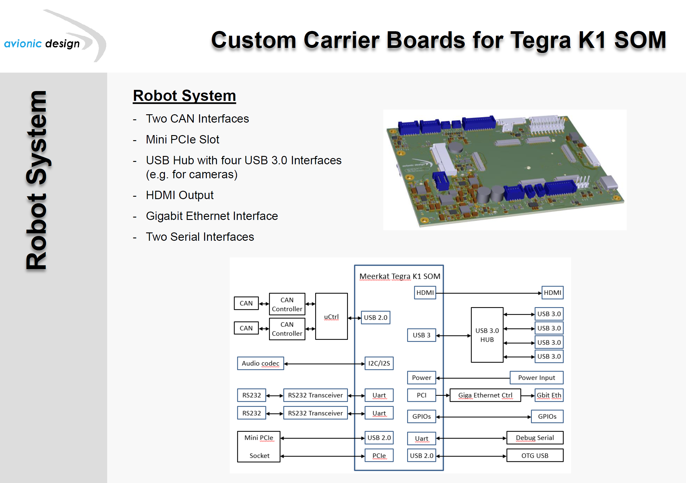
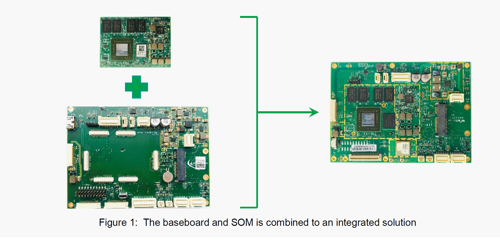
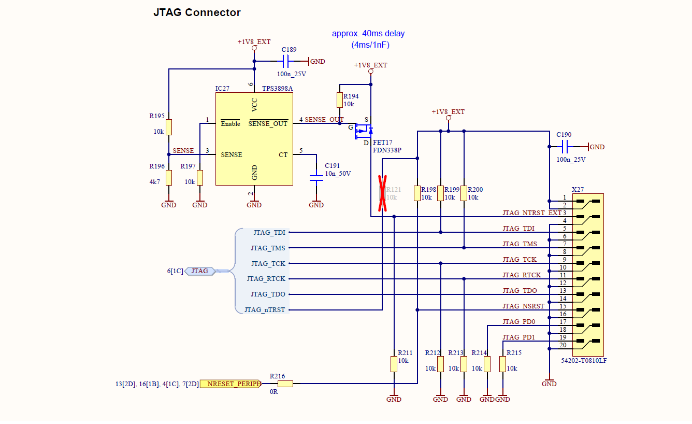
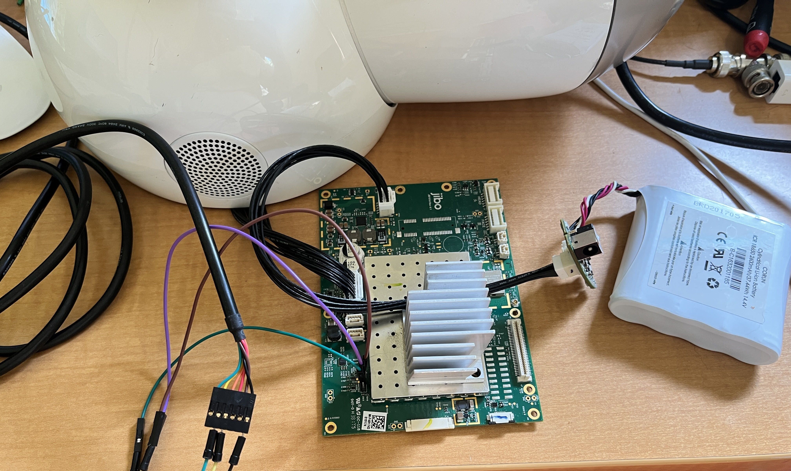
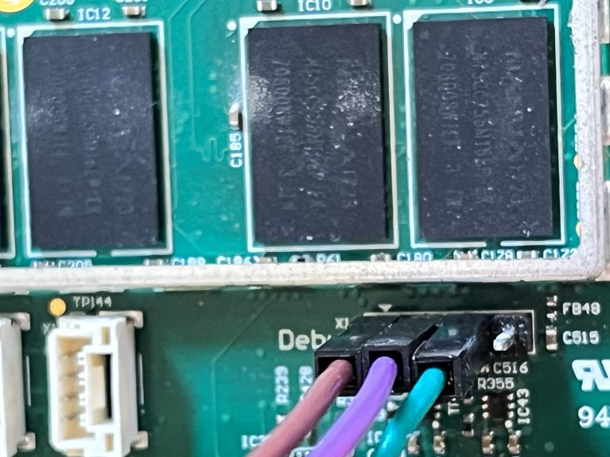
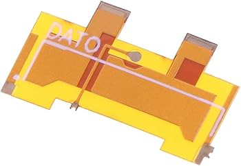
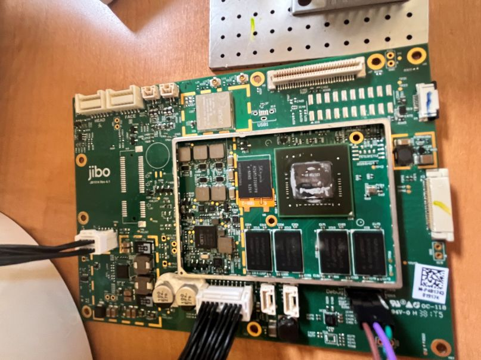

# HW_Notes
Jibo mainboard was based upon hardware designed by Avionic's Design

    from Uboot log
    Model: Avionic Design Kein Baseboard
    Board: Avionic-Design Kein Baseboard, ID: -2

    [    0.000000] Machine: Avionic Design Meerkat (Device Tree), model: Avionic Design Tobor All In One, serial: 0
    
Details on that board and its related carrier board are described here [Tegra K1 SOM](documents/Tegra_K1_SOM_manual.pdf) 
and [Meerkat Carrier Board](documents/Meerkat_k1_eval_kit.pdf). 

The Kein board provides support for:
* 2 GB DDR3
* eMMC 16 GB (eMMC5.0)
* up to 2 x4 MIPI CSI
* up to 2 x4 MIPI DSI
* 1x eDP
* up to 5 PCIe lanes
* 2x standard USB 2.0 hosts
* 1x HSIC (shared with USB1)
* 1x standard USB 2.0 client (configurable as host)
* up to 2x USB 3.0 hosts
* 1x standard SATA
* 1x standard SDMMC (4 bit)
* 1x standard SDMMC/SDIO (4 bit)
* 2x DAP (I2S/PCM)
* 1x Debug UART
* 3x UART
* 2x standard I2C (1x 3.3 V and 1x 1.8 V)
* 4x SPI
* 8x 1.8V GPIOs
* 22x 3.3V GPIOs
* 1x JTAG
* 1x S/PDIF In/Out
* 1x standard HDMI 1.4b

It appears that Jibo incorporates this SOM board design directly onto its carrier board. See 
 and 

The Meerkat SOM looks like  while Jibo looks like 

From these documents we can guess at the unpopulated pads on the Jibo cpu board, identifying the location for a spare 
debug USB, JTAG and either the PCIe or additional GPIO (SPI/I2C ports) 

The underside of the board looks like  
The test points might be used to exfiltrate the eMMC and will be identified.

From the SOM manual "The Tegra K1 has four SD/MMC controllers. The Meerkat uses SDMMC3 for an SD Card interface and
SDMMC4 to interface to an eMMC device (primary boot option). SDMMC1 is available to use as SDIO.
SDMMC2 is not routed on the Meerkat SoM.

For the SD Card and SDIO interfaces, SDMMC3 and SDMMC1 support up to UHS-1. For eMMC, SDMMC4
supports up to HS200." 

Details on the SK Hynix eMMC chip are located in [memory](documents/SK_hynix_1ynm_64Gb_eMMC5_1_ver1_6.pdf)

## JTAG
From the Meerkat schematic we can see how to populate the JTAG connector  
We will add a DigiKey cart to purchase these after we give it a try.

## Power Connector X1
Jibo gets power from the rectangular X1 JST American 10 pin 1.5mm spacing connector, part number ZPDR-10V-S and
BM10B-ZPDSS-TF available at Digikey (455-2528-ND, 455-BM10B-ZPDSS-TFCT-ND). This connector receives power from a LiIon
regulator/charger in the robots base. I2C (SMB) is used to control the charger and passed along the cable, along with a 
power good and enable.

#### Known Pinouts 
 | From Pin | To Pin | Function  | 
 |----------|--------|-----------|
 | 1        | 1      | +18.6 V   |
 | 2        | 2      | +18.6 V   |
 | 3        | 3      |           |
 | 4        | 4      |           |
 | 5        | 5      |           |
 | 6        | 6      | Gnd       |
 | 7        | 7      | Gnd       |
 | 8        | 8      |           |
 | 9        | 9      |           |
 | 10       | 10     |           |

I have built the power cable (10 pin) and Control cable (18 pins) for the test setup. They are both straight through!
#### Control X12
| From Pin | To Pin | Function | From Pin | To Pin | Function |
|----------|--------|----------|----------|--------|----------|
| 1        | 1      |          | 10       | 10     |          |
| 2        | 2      |          | 11       | 11     |          |
| 3        | 3      |          | 12       | 12     |          |
| 4        | 4      |          | 13       | 13     |          |
| 5        | 5      |          | 14       | 14     |          |
| 6        | 6      |          | 15       | 15     |          |
| 7        | 7      |          | 16       | 16     |          |
| 8        | 8      |          | 17       | 17     |          |
| 9        | 9      |          | 18       | 18     |          |

## 
To create a test setup  I ordered the following from Digikey and Mouser. I used precrimped 10" leads as crimping 
needed tooling I did not have and did not come out well. 

| Part #          | Digikey     | Mouser              | Comment                                                    |
|-----------------|-------------|---------------------|------------------------------------------------------------|
| ZPDR-10V-S      | 455-2528-ND |                     | Jibo power, CONN RCPT HSG 10POS 1.50MM                     |
| ZPDR-18V-S      |             | 306-ZPDR-18V-S      | Jibo Control, CONN RCPT HSG 18POS 1.50MM                   |
| ASZPDSZPD24K254 |             | 306-ASZPDSZPD24K254 | Rectangular Cable Assemblies 10" ZPD SERIES STANDARD LEADS |

## Serial
I have noticed the serial pins reported in Reddit and on Medium are wrong as compared to the board I have, Rev 4.1. The 
correct pins and signals are below. THe arrow marks pin 1 

| Pin | Function          | 
|-----|-------------------|
| 1   | Gnd (arrow)       |
| 2   | RX (receive in)   |
| 3   | TX (trasnmit out) |
| 4   | 3.3V              |

## Next steps to explore Access to EMMC
The Switch community has developed some nice accessories to help with the access of data. I ordered a dat0 adapter  
which slides under the EMMC flash memory and provides access to the Data 0 line on the BGA. We can solder a wire to this 
and then just need to identify CMD and CLK signals. This will provide a 1 bit interface to read the data. I plan to use 
a Raspberry Pi to read the data with a suitable 1.8V logic level converter. The dat0 adapter looks like 

   